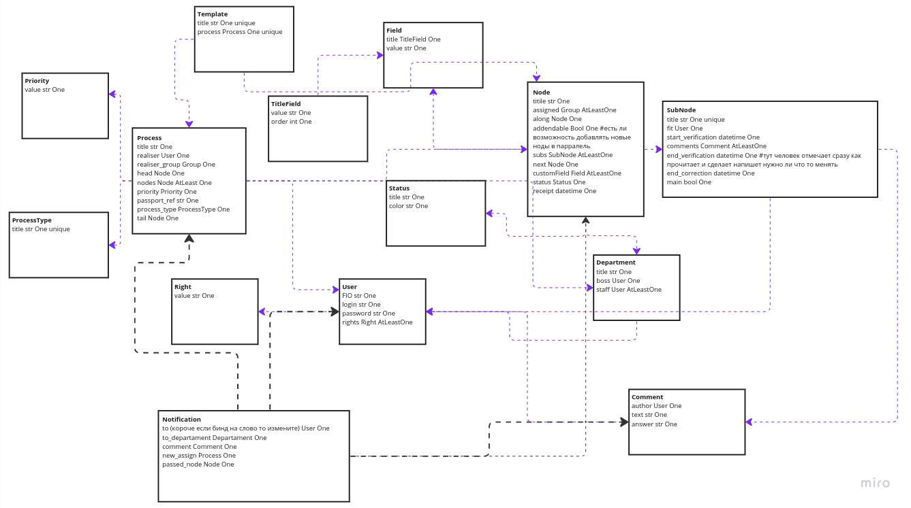
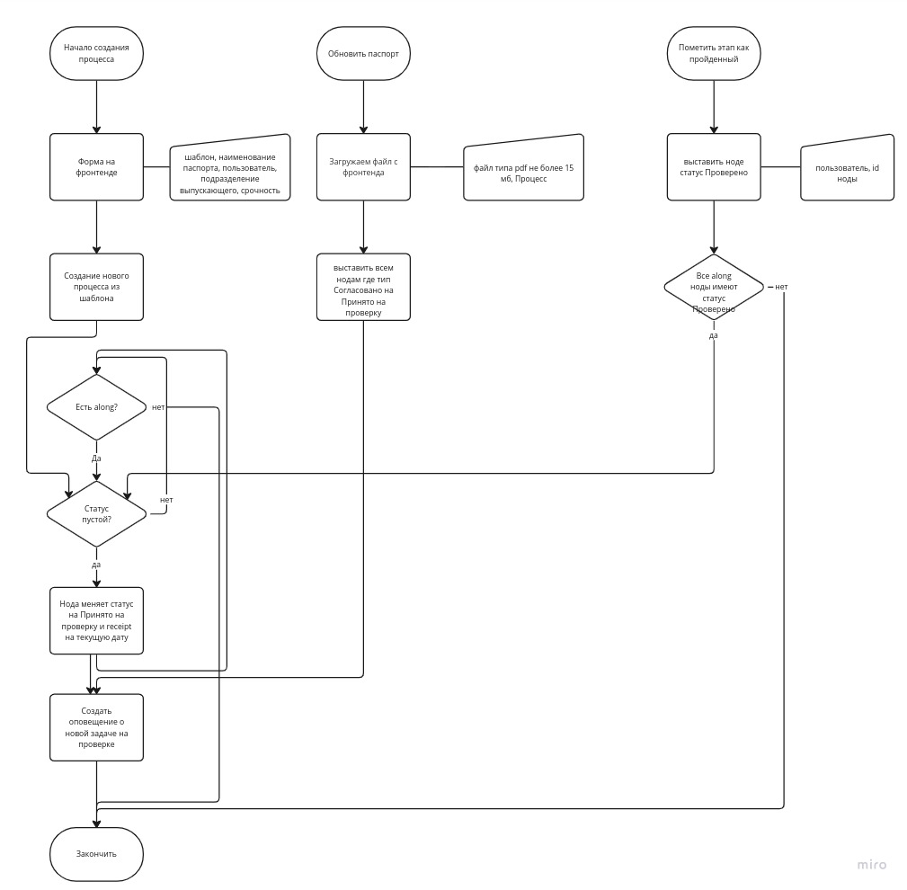
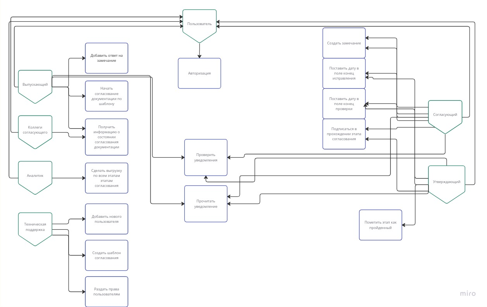

# mathmode_irkut
Единая информационная система отслеживания процесса согласования (ИСОПС)
## Задача
Данный кейс от компании Иркут, решался на III Весенней Школе Матмод МАИ.
jpg
### Главные задачи
Реализовать систему распределения задач и отслеживания согласования документации

## Информация
Таблица Miro: https://miro.com/welcomeonboard/SmZrSlM1Tm4wM2lxaWFlVGVndWhldExYSlE5TFJNQmJSSVN2MXVoOERZM2lXQzlxT0lJZkV3aXg5bVQyQUMxU3wzNDU4NzY0NTI1Nzc4NjY2NDU4fDI=?share_link_id=253311310582

Схема БД:


Основная бизнес-логика:


Диаграмма прециндентов:


API:
[API](./doc/bd.jpg)

## Как запустить на локальной машине
в директории app \
установить edgedb 
```
curl --proto '=https' --tlsv1.2 -sSf https://sh.edgedb.com | sh
source <Путь_из_вывода>
```
запустить БД и API (в докере): \ 
```
sudo rm -rf ./data
sudo rm -rf ./dbschema
docker-compose --env-file .env -f docker-compose.yml up
```
(в docker-compose только образ edgeDB) \

Запустить фронт (локально)
